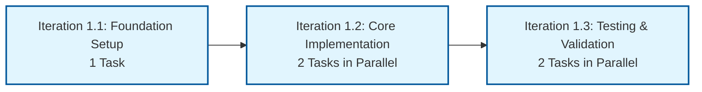
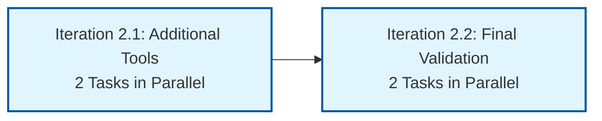

# Tasks   Lunch Money MCP Server

_Building on [**TDD**](./tdd.md) - actionable work items for implementing the MCP server with focused checkpoints._

---

## Legend

- **Checkpoint:** Major development milestone with clear deliverables
- **Iteration:** Sequential dependency phase within a checkpoint (i1 → i2 → i3)
- **Task:** Individual merge request that can run parallel within same iteration
- **Sub-task:** Individual commit within the merge request

---

## Checkpoint 1: MCP Server + Test Component

### Iteration 1.1: Foundation Setup

_(Must complete before Iteration 1.2 can start)_

- [x] c1.i1.t1 Initialize TypeScript MCP Server Project Structure
  - Reference: [Component 1: MCP Server Structure](tdd.md#component-1-mcp-server-structure)
  - Reference: [Development Environment Requirements](tdd.md#component-1-mcp-server-structure) (bun version, .tool-versions)
  - Reference: [Checkpoint 1 Requirements](tdd.md#checkpoint-1-mcp-server--test-component)
  - [x] c1.i1.t1.1 Create package.json with MCP SDK and dependencies
  - [x] c1.i1.t1.2 Setup TypeScript configuration and build scripts
  - [x] c1.i1.t1.3 Create src/tools/ folder structure as specified
  - [x] **Extra:** Update Axios to ^1.7.0 (PR review feedback)
  - [x] **Extra:** Enhanced agent.action.md with validation-first workflow and dependency checking
  - [x] **Extra:** Added PR consistency validation and extra work tracking requirements

### Iteration 1.2: Core Implementation

_(Can run in parallel after Iteration 1.1 completes)_

- [ ] c1.i2.t1 Implement Basic MCP Server With Tool Registration

  - Reference: [Component 1: MCP Server Structure](tdd.md#component-1-mcp-server-structure)
  - Addresses: c1.r1, c1.r2, c1.r3, c1.r4 from TDD
  - [x] c1.i2.t1.1 Create src/index.ts with McpServer setup
  - [ ] c1.i2.t1.2 Add StdioServerTransport connection
  - [ ] c1.i2.t1.3 Register get_transactions tool with schema
  - [ ] c1.i2.t1.4 Add start script and test server startup

- [ ] c1.i2.t2 Implement Get Transactions Tool Handler With Validation
  - Reference: [Component 2: Async Tool Handler Pattern](tdd.md#component-2-async-tool-handler-pattern)
  - Addresses: c1.r5, c1.r6, c1.r7, c1.r8 from TDD
  - [ ] c1.i2.t2.1 Create src/tools/getTransactions.ts with Zod schema
  - [ ] c1.i2.t2.2 Implement async handler with axios HTTP client
  - [ ] c1.i2.t2.3 Add URL parameter building with URLSearchParams
  - [ ] c1.i2.t2.4 Add proper error handling with isError flag

### Iteration 1.3: Testing & Validation

_(Can run in parallel after Iteration 1.2 completes)_

- [ ] c1.i3.t1 Setup Comprehensive Testing Framework

  - Reference: [Component 2: Testing Organization](tdd.md#component-2-async-tool-handler-pattern)
  - Addresses: c1.r9, c1.r10, c1.r11, c1.r12 from TDD
  - [ ] c1.i3.t1.1 Create src/tools/getTransactions.test.ts test file
  - [ ] c1.i3.t1.2 Add unit tests for schema validation patterns
  - [ ] c1.i3.t1.3 Add tests for HTTP request building logic
  - [ ] c1.i3.t1.4 Add error handling test cases and verify coverage

- [ ] c1.i3.t2 Verify End-to-End MCP Communication Flow
  - Reference: [Checkpoint 1 Requirements](tdd.md#checkpoint-1-mcp-server--test-component)
  - Addresses: c1.r3, c1.r4, c1.r6, c1.r7 from TDD
  - [ ] c1.i3.t2.1 Test server connection with MCP Inspector
  - [ ] c1.i3.t2.2 Verify tool advertisement in inspector interface
  - [ ] c1.i3.t2.3 Execute get_transactions tool via inspector
  - [ ] c1.i3.t2.4 Validate transaction data or error response

## Checkpoint 2: Categories and Tags Tools

### Iteration 2.1: Additional Tool Implementation

_(Can run in parallel after Checkpoint 1 completes)_

- [ ] c2.i1.t1 Implement Get Categories Tool Handler

  - Reference: [Component 2: Async Tool Handler Pattern](tdd.md#component-2-async-tool-handler-pattern)
  - Addresses: c2.r1, c2.r2, c2.r3, c2.r4 from TDD
  - [ ] c2.i1.t1.1 Create src/tools/getCategories.ts with Zod schema
  - [ ] c2.i1.t1.2 Implement handler for /v1/categories endpoint
  - [ ] c2.i1.t1.3 Add categories tool registration to main server
  - [ ] c2.i1.t1.4 Test categories data access via MCP Inspector

- [ ] c2.i1.t2 Implement Get Tags Tool Handler
  - Reference: [Component 2: Async Tool Handler Pattern](tdd.md#component-2-async-tool-handler-pattern)
  - Addresses: c2.r5, c2.r6, c2.r7, c2.r8 from TDD
  - [ ] c2.i1.t2.1 Create src/tools/getTags.ts with Zod schema
  - [ ] c2.i1.t2.2 Implement handler for /v1/tags endpoint
  - [ ] c2.i1.t2.3 Add tags tool registration to main server
  - [ ] c2.i1.t2.4 Test tags data access via MCP Inspector

### Iteration 2.2: Testing & Final Validation

_(Can run in parallel after Iteration 2.1 completes)_

- [ ] c2.i2.t1 Add Comprehensive Test Coverage For New Tools

  - Reference: [Component 2: Testing Organization](tdd.md#component-2-async-tool-handler-pattern)
  - Follows established testing patterns from Checkpoint 1
  - [ ] c2.i2.t1.1 Create src/tools/getCategories.test.ts test file
  - [ ] c2.i2.t1.2 Create src/tools/getTags.test.ts test file
  - [ ] c2.i2.t1.3 Add integration tests for all three tools together
  - [ ] c2.i2.t1.4 Verify test coverage meets quality standards

- [ ] c2.i2.t2 Validate Complete Financial Data Access Capability
  - Reference: [Checkpoint 2 Requirements](tdd.md#checkpoint-2-categories-and-tags-tools)
  - Addresses: c2.r9, c2.r10, c2.r11, c2.r12 from TDD
  - [ ] c2.i2.t2.1 Test transactions + categories + tags via MCP
  - [ ] c2.i2.t2.2 Verify user can access all essential financial data
  - [ ] c2.i2.t2.3 Validate data completeness for analysis use cases
  - [ ] c2.i2.t2.4 Document successful MCP server implementation
