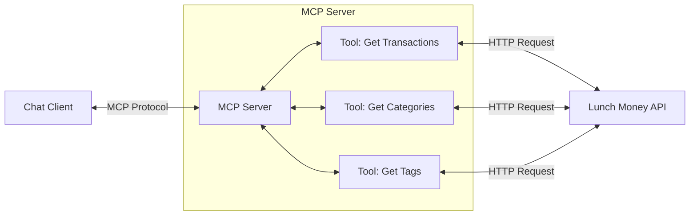

<div align="center">

# TDD <br/> Lunch Money MCP Server

_Building on [**PRD**](./prd.md) - this document explains how we'll deliver essential transaction data access through MCP with 2 focused checkpoints._

</div>

---

## Table of Contents

- [Architecture & Components](#architecture--components)
  - [Architecture Overview](#architecture-overview)
  - [Component 1: MCP Server Structure](#component-1-mcp-server-structure)
  - [Component 2: Async Tool Handler Pattern](#component-2-async-tool-handler-pattern)
- [Implementation Checkpoints](#implementation-checkpoints)
  - [Sequencing Strategy](#sequencing-strategy)
  - [Checkpoint 1: MCP Server + Test Component](#checkpoint-1-mcp-server--test-component)
  - [Checkpoint 2: Categories and Tags Tools](#checkpoint-2-categories-and-tags-tools)

---

## 🏗️ Architecture & Components

**(Engineers - Implementation Guide)**

### Architecture Overview

Simple MCP server that registers essential tools for Lunch Money data access.
Focuses on transactions, categories, and tags - the core data users need for
financial analysis. The MCP SDK handles all protocol communication.



Each component is a concrete implementation piece. The MCP SDK handles
protocol communication - we build the server structure and tool handlers.

### **Component 1: MCP Server Structure**

Basic MCP server setup using the TypeScript SDK with tool registration.

**Technical Details:**

```typescript
// src/index.ts
import { McpServer } from "@modelcontextprotocol/sdk/server/mcp";
import { StdioServerTransport } from "@modelcontextprotocol/sdk/server/stdio";
import {
  handleGetTransactions,
  getTransactionsSchema,
} from "./tools/getTransactions";

const server = new McpServer({
  name: "lunch-money-mcp",
  version: "0.1.0",
});

// Register tools with Zod schemas
server.registerTool(
  "get_transactions",
  {
    title: "Get Transactions",
    description: "Fetch transactions from Lunch Money API",
    inputSchema: getTransactionsSchema,
  },
  handleGetTransactions
);

// Connect to transport
const transport = new StdioServerTransport();
await server.connect(transport);
```

**Folder Structure:**

- `src/index.ts` - Main server file
- `src/tools/` - Tool handler functions with tests alongside
- `src/tools/getTransactions.ts` - Tool handler
- `src/tools/getTransactions.test.ts` - Tests for tool handler

**Development Environment Requirements:**

- **Bun Runtime:** Version 1.2.5 or higher required
- **Version Management:** Create `.tool-versions` file with `bun 1.2.5` if:
  - File doesn't already exist in project root
  - Required bun version is not specified in existing file
  - Current system bun version doesn't meet minimum requirements
- **Package Management:** Use `bun install` for dependency installation
- **Build Target:** Configure for bun runtime (see tsconfig.json)

**Package.json Scripts:**
See `@rules/tech-stack.spec.md` for standard configuration and scripts.

### **Component 2: Async Tool Handler Pattern**

Strongly-typed async tool handlers using Zod schemas for input validation
and axios for external API calls.

**Technical Details:**

```typescript
// src/tools/getTransactions.ts
import { z } from "zod";
import axios from "axios";

export const getTransactionsSchema = {
  start_date: z.string().optional().describe("Start date (YYYY-MM-DD)"),
  end_date: z.string().optional().describe("End date (YYYY-MM-DD)"),
  category_id: z.number().optional().describe("Filter by category ID"),
};

export async function handleGetTransactions(
  args: z.infer<typeof getTransactionsSchema>
) {
  try {
    const { start_date, end_date, category_id } = args;

    // Build URL with query parameters using native URLSearchParams
    const url = new URL("https://dev.lunchmoney.app/v1/transactions");
    if (start_date) url.searchParams.append("start_date", start_date);
    if (end_date) url.searchParams.append("end_date", end_date);
    if (category_id)
      url.searchParams.append("category_id", String(category_id));

    const response = await axios.get(url.toString(), {
      headers: {
        Authorization: `Bearer ${process.env.LUNCH_MONEY_API_KEY}`,
      },
    });

    return {
      content: [
        {
          type: "text",
          text: JSON.stringify(response.data, null, 2),
        },
      ],
    };
  } catch (error) {
    return {
      content: [
        {
          type: "text",
          text: `Error fetching transactions: ${error.message}`,
        },
      ],
      isError: true,
    };
  }
}
```

**Recommended Organization:**

- One file per tool handler in `src/tools/`
- Export Zod schema for tool registration
- Use native Web APIs (URLSearchParams, URL) instead of custom helpers
- Use axios for HTTP requests with proper error handling
- Proper error handling with `isError: true`
- Test file alongside source: `src/tools/getTransactions.test.ts`

**Testing:** Follow `@rules/test.spec.md` for all testing patterns and examples.

---

## 🎯 Implementation Checkpoints

**(PMs - Validation & Demo Points)**

### Sequencing Strategy

Ship fast with focused checkpoints that prove core MCP server functionality.
This feature delivers essential transaction data access - additional API
endpoints can be added in future features.

### Checkpoint 1: MCP Server + Test Component

Get basic MCP server running with one simple tool to verify end-to-end
communication using MCP Inspector.

#### Requirements:

**MCP Server Setup (Component 1)**

- [ ] c1.r1 Given MCP TypeScript SDK and bun are installed
- [ ] c1.r2 When server starts with `bun run start`
- [ ] c1.r3 Then MCP Inspector (https://github.com/modelcontextprotocol/inspector) can connect
- [ ] c1.r4 Then server advertises "get_transactions" tool in inspector

**Test Tool Handler (Component 2)**

- [ ] c1.r5 Given LUNCH_MONEY_API_KEY environment variable is set
- [ ] c1.r6 When user calls "get_transactions" tool via MCP Inspector
- [ ] c1.r7 Then tool handler returns transaction data or clear error
- [ ] c1.r8 Then end-to-end MCP communication is verified

**Unit Testing Setup**

- [ ] c1.r9 Given test file `getTransactions.test.ts` exists alongside source
- [ ] c1.r10 When running `bun test`
- [ ] c1.r11 Then unit tests pass for getTransactions function patterns
- [ ] c1.r12 Then test coverage shows handler input validation works correctly

### Checkpoint 2: Categories and Tags Tools

Add two more tools using the proven Component 2 pattern to verify the
approach scales to multiple endpoints.

#### Requirements:

**Categories Data Access**

- [ ] c2.r1 Given the transactions tool works from Checkpoint 1
- [ ] c2.r2 When user asks "show me my spending categories" via MCP
- [ ] c2.r3 Then user receives a list of all their categories
- [ ] c2.r4 Then categories include names, descriptions, and budget settings

**Tags Data Access**

- [ ] c2.r5 Given the categories feature works
- [ ] c2.r6 When user asks "show me my transaction tags" via MCP
- [ ] c2.r7 Then user receives a list of all their tags
- [ ] c2.r8 Then tags include names and descriptions

**Complete Organization Data**

- [ ] c2.r9 Given both categories and tags are accessible
- [ ] c2.r10 When user needs to understand their transaction organization
- [ ] c2.r11 Then user can access transactions, categories, and tags all through MCP
- [ ] c2.r12 Then user has essential financial data access through MCP for analysis
