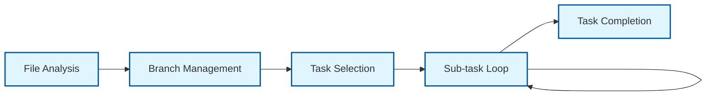
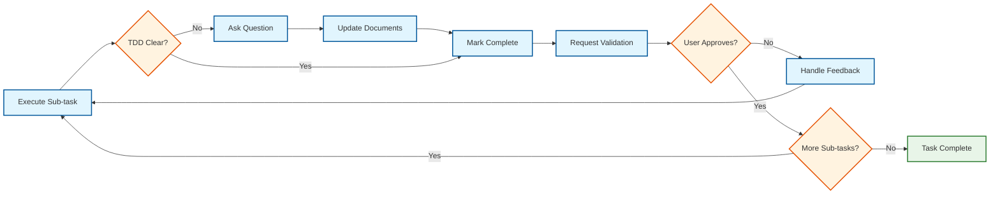
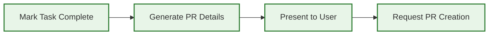

<div align="center">

# Cursor Rule - Agent Task Execution

_Systematic approach for LLM agents to execute tasks from task.md files with user validation at each step._

</div>

---

## Example Usage Prompt

```
@agent docs/2025-07-20-lunchmoney-mcp-server/tasks.md
```

**Prerequisites:** Must have a properly formatted tasks.md file with c1.i1.t1 structure

## File Validation Requirements

- **Target File:** Must be named `tasks.md` or have `tasks` in the filename
- **File Structure:** Must contain checkpoint/iteration/task hierarchy
- **Task Format:** Must use c1.i1.t1 naming convention
- **Reject Invalid:** Return error if file doesn't match tasks.md format

## Agent Execution Workflow



### Step 1: File Analysis

1. Validate target file is a tasks.md file
2. Parse checkpoint/iteration structure
3. Identify current task status (find first uncompleted task)
4. Display current iteration dependencies to user

### Step 1.5: Branch Management

1. **Check Current Branch:** Verify what branch we're currently on
2. **🛑 NEVER Work on Main:** If on `main` branch, MUST create feature branch before any code changes
3. **Propose Branch Name:** Generate branch name using format: `[feature-name]/[checkpoint]-[iteration]-[task]-[description]`
4. **Create Branch:** Create and switch to feature branch before starting work
5. **Branch Naming Convention:**
   - Format: `[feature-name]/[checkpoint]-[iteration]-[task]-[description]`
   - Feature name derived from docs folder (e.g., `lunchmoney-mcp-server`)
   - Task identifier includes checkpoint, iteration, and task number
   - Description summarizes the specific work being done
   - Examples:
     - `lunchmoney-mcp-server/c1-i1-t1-foundation-setup`
     - `lunchmoney-mcp-server/c1-i2-t1-mcp-server-implementation`
     - `lunchmoney-mcp-server/c1-i2-t2-transaction-tool-handler`
     - `user-auth-system/c1-i1-t1-database-schema`
   - **Self-Descriptive:** Anyone can see feature + task from branch name alone

### Step 2: Task Selection

1. Select next uncompleted task in sequence
2. **🔍 DEPENDENCY CHECK:** Verify iteration dependencies are satisfied:
   - Check if task depends on previous iteration (e.g., c1.i2.t1 depends on c1.i1.\* completion)
   - **🛑 BRANCH MERGE VALIDATION:** If dependent iteration exists, verify that work is merged to main branch
   - **🚫 BLOCK EXECUTION:** If dependent iteration not merged to main, STOP and inform user cannot proceed
   - **Error Message:** "Cannot execute [task] - Iteration [x.y] must be merged to main branch first"
3. Display task details and sub-tasks to user
4. Ask for user confirmation to proceed

### Step 3: Sub-task Execution Loop



For each sub-task within the selected task:

1. **Execute:** Complete the sub-task work (code, files, tests, etc.)
2. **Handle TDD Inconsistencies:** If implementation details conflict with or are missing from TDD, ask **Question:** for user clarification
3. **Update Documents:** If clarification changes requirements, update TDD and tasks.md accordingly
4. **📋 Track Extra Work:** If doing work outside original task scope (e.g., dependency updates, PR feedback), document it:
   - Add extra work items to tasks.md under current task with clear labels
   - Example: `- [x] Extra: Update Axios to ^1.7.0 (PR review feedback)`
   - Maintain clear separation between planned task work and additional work
5. **🔧 FUNCTIONAL VALIDATION:**
   - **🛑 MANDATORY:** Verify .gitignore exists and includes `node_modules/` before installing dependencies
   - Test package management commands work (e.g., `bun install`, `npm install`)
   - Verify TypeScript compilation and runtime validation (e.g., `bunx tsc --noEmit`)
   - Test that package.json scripts execute without errors
   - Confirm all generated files are functionally correct and properly ignored by git
   - **🛑 NEVER commit node_modules or dependency folders to git**
6. **Mark Complete:** Update tasks.md to mark sub-task with `[x]` ONLY after functional validation passes
7. **🛑 MANDATORY STOP:** Ask user to review and confirm work quality with validation evidence
8. **🛑 WAIT FOR APPROVAL:** Must receive explicit user response containing "approved" or "looks good"
9. **❌ COMMIT PREVENTION CHECKPOINT:** Before ANY commit command, agent MUST:
   - ✅ Have received explicit user approval message
   - ✅ Ask: "Ready to commit these changes?"
   - ✅ Wait for user response with "Yes, commit" or "commit approved"
   - ❌ NEVER use git commands (add, commit) without this specific approval sequence
10. **🔧 COMMIT AFTER APPROVAL:** Only commit locally AFTER user validates and approves the work
11. **🚫 NEVER PUSH:** Do NOT push to remote - user controls when to push
12. **Handle Feedback:** If user requests changes, implement and re-validate functionally before re-requesting approval

**⚠️ CRITICAL RULES:**

- **NEVER execute multiple sub-tasks in sequence without user validation between each one**
- **NEVER mark sub-task complete without functional validation (dependencies install, scripts run, environment works)**
- **ALWAYS provide evidence that the work functions, not just that files were created**
- **🚫 NEVER PUSH TO REMOTE:** Only commit locally - user decides when to push
- **🛑 AGENT STOPS AT:** Validation request + wait for user approval + THEN commit after approval
- **❌ ABSOLUTE COMMIT PROHIBITION:** NEVER run `git add` or `git commit` commands without:
  1. User approval of the work
  2. Explicit "Ready to commit?" question asked
  3. User response with "Yes, commit" or equivalent
- **🚫 FILE ACCEPTANCE ≠ COMMIT APPROVAL:** Even if files show "accepted", still ask "Ready to commit?"

### Commit Prevention Enforcement

**Two-Step Approval Process Required:**

1. **Work Approval:** User reviews and approves the quality of work done
2. **Commit Approval:** User explicitly approves committing the changes to git

**Why Two Steps?**

- Work can be approved but user may want additional changes before commit
- File "accepted" status in UI ≠ "ready to commit" approval
- User maintains complete control over when changes are committed to git history

**Mandatory Phrases for Commit Approval:**

- Agent must ask: "Ready to commit these changes?"
- User must respond with: "Yes, commit" / "commit approved" / "go ahead and commit"
- ANY git command requires this explicit commit approval sequence

### Step 4: Task Completion



When all sub-tasks are complete:

1. **Mark Task Complete:** Update tasks.md to mark main task with `[x]`
2. **Generate PR Details:** Create merge request title and description
3. **Present to User:** Show PR title, description, and summary of work completed
4. **Request PR Creation:** Ask user to confirm creating the pull request

## Task Execution Rules

### Sequential Execution

- **One Task Only:** Execute exactly one task (c1.i1.t1) per session
- **Sub-task Order:** Complete sub-tasks in numerical order (t1.1 → t1.2 → t1.3)
- **No Skipping:** Cannot skip sub-tasks or move to next task without completion
- **Dependency Respect:** Verify iteration dependencies before starting

### Correct Sub-task Execution Example

```
Agent: Executing c1.i1.t1.1 - Create package.json with MCP SDK...
[creates package.json file]
[runs bun install to verify dependencies work]
[verifies development environment meets TDD requirements]
[tests that bun scripts work: bun run start, bun test, etc.]
[updates tasks.md to mark c1.i1.t1.1 as complete with [x]]

Agent: ✅ Sub-task c1.i1.t1.1 Complete: Created package.json with MCP SDK dependencies.

**Functional Validation Evidence:**
- ✅ Dependencies installed successfully (node_modules created)
- ✅ bun.lockb file generated
- ✅ Development environment validated per TDD requirements
- ✅ Scripts validated: `bun run start` ready

**Please review the package.json file and validation evidence. Does this look correct?**

[🛑 AGENT STOPS HERE - WAITS FOR USER APPROVAL - DOES NOT COMMIT OR PUSH]

User: Yes, approved.

Agent: **Ready to commit these changes?**

[🛑 COMMIT PREVENTION CHECKPOINT - WAITS FOR EXPLICIT COMMIT APPROVAL]

User: Yes, commit.

Agent: [commits changes locally with descriptive message]
Agent: ✅ Changes committed locally. Ready to proceed to c1.i1.t1.2.

User: Yes, looks good.

Agent: Executing c1.i1.t1.2 - Setup TypeScript configuration...
[creates tsconfig.json]
[runs TypeScript compiler to verify config works]
[tests bun build command with TypeScript]
[updates tasks.md to mark c1.i1.t1.2 as complete with [x]]

Agent: ✅ Sub-task c1.i1.t1.2 Complete: Created TypeScript configuration.

**Functional Validation Evidence:**
- ✅ TypeScript compiles without errors
- ✅ bun build command works
- ✅ Type checking passes

**Please review the tsconfig.json and validation evidence. Does this look correct for proceeding to c1.i1.t1.3?**

[Continue this pattern for each sub-task...]
```

### User Validation Points

- **Before Task Start:** Confirm user wants to execute the selected task
- **During Implementation:** Ask **Question:** when TDD details are unclear or inconsistent
- **🛑 After Each Sub-task:** MANDATORY - Mark complete with `[x]`, present work, and wait for explicit user approval before proceeding to next sub-task
- **Before PR Creation:** Confirm PR title/description with user and inform them to assign themselves as assignee
- **🔍 Before Push:** Validate PR title/description consistency with all changes made during session
- **📋 For Extra Work:** Update tasks.md to document any work done outside original task scope
- **On Errors:** Stop and request user guidance for any issues

### Progress Tracking

- **Update tasks.md:** Mark completed items with `[x]` in real-time
- **Status Display:** Show current progress within iteration
- **Next Steps:** Inform user what task comes next in the sequence

## Pull Request Generation

### PR Creation Process

1. **Confirm with User:** Ask user to confirm PR title and description before creating
2. **Create PR:** Use GitHub MCP to create pull request with proper title/description
3. **⚠️ Assignee Limitation:** Current GitHub MCP tools don't support setting assignees during creation
4. **User Action Required:** Inform user to manually assign themselves as assignee in GitHub UI
5. **PR Link:** Provide direct link to created PR for easy access

### PR Consistency Validation (Before Push)

1. **🔍 Review All Changes:** Check git log to identify all commits made during session
2. **📋 Validate PR Title:** Ensure PR title reflects ALL work done, not just original task
3. **📝 Validate PR Description:** Verify description includes all changes, updates, and extra work
4. **🆕 Update PR if Needed:** If significant extra work was done, update PR title/description to reflect complete scope
5. **📚 Document Extra Work:** Update tasks.md to track any work done outside original task scope

### PR Title Format

Use the exact task name from tasks.md:

```
Implement Basic MCP Server With Tool Registration
```

### PR Description Template

```markdown
## Summary

[Brief description of what was accomplished]

## Tasks Completed

- [x] c1.i1.t1.1 [Sub-task description]
- [x] c1.i1.t1.2 [Sub-task description]
- [x] c1.i1.t1.3 [Sub-task description]

## Files Changed

- [List of files created/modified]

## Testing

- [Testing completed or test files created]

## References

- Reference: [TDD Component Link from task]
- Addresses: [Requirements from task]
```

## Error Handling

### Invalid File Types

```
Error: Target file must be a tasks.md file with c1.i1.t1 structure.
Please provide a valid tasks.md file.
```

### Missing Dependencies

```
Error: Cannot execute c1.i2.t1 - Iteration 1.1 must complete first.
Next available task: c1.i1.t1
```

### Iteration Dependency - Branch Not Merged

```
🛑 Error: Cannot execute c1.i2.t1 - Iteration 1.1 must be merged to main branch first.

Current Status:
- Target Task: c1.i2.t1 [Task Name]
- Required Dependency: Iteration 1.1 completion merged to main
- Current Branch: [current-branch-name]
- Issue: Previous iteration work not yet merged to main branch

Resolution Required:
1. Complete and merge iteration 1.1 work to main branch
2. Pull latest main branch changes
3. Then restart with c1.i2.t1 execution

Cannot proceed with current task until dependency is merged to main.
```

### Branch Management Errors

```
🛑 Error: Currently on 'main' branch. Cannot proceed with task execution.

Feature: lunchmoney-mcp-server (derived from docs/2025-07-20-lunchmoney-mcp-server/)
Task: c1.i1.t1 Initialize TypeScript MCP Server Project Structure
Proposed branch name: lunchmoney-mcp-server/c1-i1-t1-foundation-setup

Do you want me to:
1. Create and switch to the proposed branch
2. Use a different branch name
3. Switch to an existing branch

Please specify your preference before proceeding.
```

### User Rejection

```
Task execution paused. Please provide feedback on what needs to be changed.
Ready to continue when you approve the current sub-task.
```

### TDD Inconsistencies

```
**Question:** The TDD specifies [X] but during implementation I discovered [Y].
How should I proceed? Should I:
1. [Option A description]
2. [Option B description]
3. [Alternative approach]

This may require updating the TDD document and potentially the tasks.md file.
```

## Quality Standards

### Code Implementation

- **Follow TDD References:** Implement exactly as specified in referenced TDD components
- **Ask for Clarification:** When TDD is unclear or missing details, ask **Question:** for user guidance
- **Document Updates:** Update TDD and tasks.md when clarifications change requirements
- **Complete Implementation:** Don't create stubs - implement fully working code
- **Test Coverage:** Create tests when sub-tasks specify testing
- **Documentation:** Add comments and documentation as specified

### File Management

- **Organized Structure:** Follow folder structure specified in task details
- **Clean Commits:** Each sub-task becomes one logical commit
- **No Temporary Files:** Clean up any temporary files created during work

## Success Criteria

**Task Execution Complete When:**

1. All sub-tasks marked complete with `[x]` in tasks.md
2. All code/files implemented and working
3. User has validated each sub-task
4. PR title and description generated
5. Ready for user to create pull request

**Session End:**

1. Display next available task for future sessions
2. Show overall iteration progress
3. Note any TDD/tasks.md updates made during session
4. Provide clear status of what was accomplished
