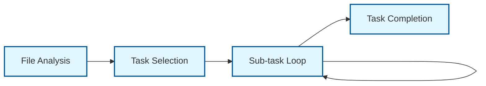
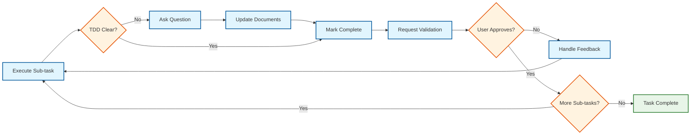
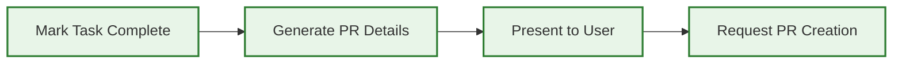

<div align="center">

# Cursor Rule - Agent Task Execution

_Systematic approach for LLM agents to execute tasks from task.md files with user validation at each step._

</div>

---

## Example Usage Prompt

```
@agent docs/2025-07-20-lunchmoney-mcp-server/tasks.md
```

**Prerequisites:** Must have a properly formatted tasks.md file with c1.i1.t1 structure

## File Validation Requirements

- **Target File:** Must be named `tasks.md` or have `tasks` in the filename
- **File Structure:** Must contain checkpoint/iteration/task hierarchy
- **Task Format:** Must use c1.i1.t1 naming convention
- **Reject Invalid:** Return error if file doesn't match tasks.md format

## Agent Execution Workflow



### Step 1: File Analysis

1. Validate target file is a tasks.md file
2. Parse checkpoint/iteration structure
3. Identify current task status (find first uncompleted task)
4. Display current iteration dependencies to user

### Step 2: Task Selection

1. Select next uncompleted task in sequence
2. Verify iteration dependencies are satisfied
3. Display task details and sub-tasks to user
4. Ask for user confirmation to proceed

### Step 3: Sub-task Execution Loop



For each sub-task within the selected task:

1. **Execute:** Complete the sub-task work (code, files, tests, etc.)
2. **Handle TDD Inconsistencies:** If implementation details conflict with or are missing from TDD, ask **Question:** for user clarification
3. **Update Documents:** If clarification changes requirements, update TDD and tasks.md accordingly
4. **Mark Complete:** Update tasks.md to mark sub-task with `[x]`
5. **🛑 MANDATORY STOP:** Ask user to review and confirm work quality
6. **🛑 WAIT FOR APPROVAL:** Do NOT proceed to next sub-task without explicit user approval
7. **Handle Feedback:** If user requests changes, implement and re-validate

**⚠️ CRITICAL RULE: NEVER execute multiple sub-tasks in sequence without user validation between each one.**

### Step 4: Task Completion



When all sub-tasks are complete:

1. **Mark Task Complete:** Update tasks.md to mark main task with `[x]`
2. **Generate PR Details:** Create merge request title and description
3. **Present to User:** Show PR title, description, and summary of work completed
4. **Request PR Creation:** Ask user to confirm creating the pull request

## Task Execution Rules

### Sequential Execution

- **One Task Only:** Execute exactly one task (c1.i1.t1) per session
- **Sub-task Order:** Complete sub-tasks in numerical order (t1.1 → t1.2 → t1.3)
- **No Skipping:** Cannot skip sub-tasks or move to next task without completion
- **Dependency Respect:** Verify iteration dependencies before starting

### Correct Sub-task Execution Example

```
Agent: Executing c1.i1.t1.1 - Create package.json with MCP SDK...
[creates package.json file]
[updates tasks.md to mark c1.i1.t1.1 as complete with [x]]

Agent: ✅ Sub-task c1.i1.t1.1 Complete: Created package.json with MCP SDK dependencies.

**Please review the package.json file. Does this look correct for proceeding to c1.i1.t1.2?**

User: Yes, looks good.

Agent: Executing c1.i1.t1.2 - Setup TypeScript configuration...
[creates tsconfig.json]
[updates tasks.md to mark c1.i1.t1.2 as complete with [x]]

Agent: ✅ Sub-task c1.i1.t1.2 Complete: Created TypeScript configuration.

**Please review the tsconfig.json file. Does this look correct for proceeding to c1.i1.t1.3?**

User: Approved.

[Continue this pattern for each sub-task...]
```

### User Validation Points

- **Before Task Start:** Confirm user wants to execute the selected task
- **During Implementation:** Ask **Question:** when TDD details are unclear or inconsistent
- **🛑 After Each Sub-task:** MANDATORY - Mark complete with `[x]`, present work, and wait for explicit user approval before proceeding to next sub-task
- **Before PR Creation:** Confirm PR title/description with user
- **On Errors:** Stop and request user guidance for any issues

### Progress Tracking

- **Update tasks.md:** Mark completed items with `[x]` in real-time
- **Status Display:** Show current progress within iteration
- **Next Steps:** Inform user what task comes next in the sequence

## Pull Request Generation

### PR Title Format

Use the exact task name from tasks.md:

```
Implement Basic MCP Server With Tool Registration
```

### PR Description Template

```markdown
## Summary

[Brief description of what was accomplished]

## Tasks Completed

- [x] c1.i1.t1.1 [Sub-task description]
- [x] c1.i1.t1.2 [Sub-task description]
- [x] c1.i1.t1.3 [Sub-task description]

## Files Changed

- [List of files created/modified]

## Testing

- [Testing completed or test files created]

## References

- Reference: [TDD Component Link from task]
- Addresses: [Requirements from task]
```

## Error Handling

### Invalid File Types

```
Error: Target file must be a tasks.md file with c1.i1.t1 structure.
Please provide a valid tasks.md file.
```

### Missing Dependencies

```
Error: Cannot execute c1.i2.t1 - Iteration 1.1 must complete first.
Next available task: c1.i1.t1
```

### User Rejection

```
Task execution paused. Please provide feedback on what needs to be changed.
Ready to continue when you approve the current sub-task.
```

### TDD Inconsistencies

```
**Question:** The TDD specifies [X] but during implementation I discovered [Y].
How should I proceed? Should I:
1. [Option A description]
2. [Option B description]
3. [Alternative approach]

This may require updating the TDD document and potentially the tasks.md file.
```

## Quality Standards

### Code Implementation

- **Follow TDD References:** Implement exactly as specified in referenced TDD components
- **Ask for Clarification:** When TDD is unclear or missing details, ask **Question:** for user guidance
- **Document Updates:** Update TDD and tasks.md when clarifications change requirements
- **Complete Implementation:** Don't create stubs - implement fully working code
- **Test Coverage:** Create tests when sub-tasks specify testing
- **Documentation:** Add comments and documentation as specified

### File Management

- **Organized Structure:** Follow folder structure specified in task details
- **Clean Commits:** Each sub-task becomes one logical commit
- **No Temporary Files:** Clean up any temporary files created during work

## Success Criteria

**Task Execution Complete When:**

1. All sub-tasks marked complete with `[x]` in tasks.md
2. All code/files implemented and working
3. User has validated each sub-task
4. PR title and description generated
5. Ready for user to create pull request

**Session End:**

1. Display next available task for future sessions
2. Show overall iteration progress
3. Note any TDD/tasks.md updates made during session
4. Provide clear status of what was accomplished
