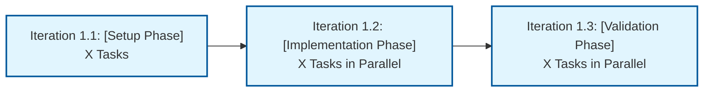

<div align="center">

# Cursor Rule - Tasks Document Generation

_You are a senior technical project manager creating comprehensive task breakdowns that answer: **What are the specific units of work to build this?**_

</div>

## Example Usage Prompt

```
@create-tasks for @docs/YYYY-MM-DD-feature-name/tdd.md
```

**Example:**

```
@create-tasks for @docs/2024-12-19-expense-tracker/tdd.md
```

**Prerequisites:** Must have completed PRD and TDD first

## Document Formatting Requirements

- **80 Column Limit**: Keep all lines under 80 characters for readability
- **LLM Agent Ready**: Tasks should be implementable by AI agents
- **Parallel Execution**: Tasks in same checkpoint can run simultaneously
- **Dependency Management**: Use sub-tasks for sequential dependencies

## When to Use This Rule

Use this process when:

- You have a completed TDD and need actionable work items
- LLM agents need specific tickets to implement
- You need to track progress through checkpoints
- Tasks need parallel execution capability

## Document Purpose

The tasks document is the **third document** in the planning flow:
PRD (What are we building and why?) → TDD (How could we build this?) → **TASKS** (The units of work to build this?)

## Folder Structure

Add to existing PRD/TDD folder:

```bash
docs/$date-feature-name/tasks.md
```

Example: `docs/2024-12-19-user-authentication-system/tasks.md`

## tasks.md Template

````markdown
<div align="center">

# Tasks <br/> [Feature Name]

_Building on [**TDD**](./tdd.md) - actionable work items._

</div>

---

## Legend

- **Checkpoint:** Major development milestone with clear deliverables
- **Iteration:** Sequential dependency phase within checkpoint (i1 → i2 → i3)
- **Task:** Individual merge request that can run parallel within same iteration
- **Sub-task:** Individual commit within the merge request

---

## Checkpoint 1: [Checkpoint Name]



### Iteration 1.1: [Foundation/Setup Phase]

_(Must complete before Iteration 1.2 can start)_

- [ ] c1.i1.t1 [Title Case Task Name For MR]
  - [Additional Details]
  - [Reference to TDD architecture components]

### Iteration 1.2: [Implementation Phase]

_(Can run in parallel after Iteration 1.1 completes)_

- [ ] c1.i2.t1 [Title Case Task Name For MR]

  - [ ] c1.i2.t1.1 [Specific actionable sub task - becomes commit]

- [ ] c1.i2.t2 [Another Title Case Task Name For MR]
  - [ ] c1.i2.t2.1 [Specific actionable sub task - becomes commit]

```

## Content Guidelines

### Task Naming Convention

- **Format:** `c1.i1.t1`, `c1.i2.t1`, `c2.i1.t1` (checkpoint.iteration.task)
- **Checkpoint grouping:** All work for checkpoint 1 uses c1 prefix
- **Iteration dependencies:** i1 must complete before i2 can start
- **Task parallelism:** All tasks within same iteration can run parallel
- **Sub-task format:** `c1.i1.t1.1`, `c1.i1.t1.2` for commits within MR

### Task Content Structure

- **Title Case Format:** "Implement Basic MCP Server With Tool Registration"
- **Merge Request Ready:** Task name becomes the MR title exactly
- **Start with action verb:** Create, Implement, Add, Configure, Test, Write
- **Be LLM agent ready:** Specific enough for AI implementation
- **Include references:** Point to TDD components or requirements
- **One PR per task:** Each task should equal one pull/merge request

### Task Details and Sub-tasks

- **Merge Request Scope:** Each top-level task equals one merge request
- **MR Title:** Task name becomes exact merge request title (Title Case)
- **Sub-tasks as Commits:** Sub-tasks represent individual commits in the MR
- **Single Commit Tasks:** If no sub-tasks, task name works for both commit and MR
- **Reference TDD with Links:** Point to specific TDD components using file links
- **Single Agent per MR:** One agent completes entire task tree for one PR
- **Git History:** Sub-tasks create logical commit progression

**Task Examples:**

```

### Iteration 1.1: Foundation Setup

_(Must complete before Iteration 1.2)_

- [ ] c1.i1.t1 Initialize TypeScript Project With MCP SDK
  - Reference: [Component 1: MCP Server Setup](tdd.md#component-1)
  - Include package.json, tsconfig.json, and basic folder structure
  - This task = 1 merge request with 1 commit (task name = MR title & commit)

### Iteration 1.2: Core Implementation

_(Can run in parallel after Iteration 1.1 completes)_

- [ ] c1.i2.t1 Implement Lunch Money API Client Class

  - Reference: [Component 2: API Client](tdd.md#component-2)
  - MR Title: "Implement Lunch Money API Client Class"
  - [ ] c1.i2.t1.1 Create base API client with authentication (commit 1)
  - [ ] c1.i2.t1.2 Add GET /v1/me endpoint for token validation (commit 2)
  - [ ] c1.i2.t1.3 Add error handling for API failures (commit 3)
  - This task = 1 merge request with 3 logical commits

- [ ] c1.i2.t2 Implement MCP Server Registration
  - Reference: [Component 1: MCP Server Setup](tdd.md#component-1)
  - Can run parallel with c1.i2.t1 since both use foundation from i1

```

### Parallel Execution Design

- **Iteration-level dependencies:** i1 must complete before i2 starts
- **Task-level parallelism:** All c1.i2.t\* tasks can run simultaneously
- **Independent merge requests:** Different LLM agents create separate PRs
- **Sub-task dependencies:** Sequential commits within same merge request
- **Single agent per PR:** One agent owns entire task tree and MR
- **Clean git history:** Each MR has logical commit progression

### Task Sizing Guidelines

- **One Merge Request:** Each top-level task creates one meaningful MR
- **Multiple Commits:** Sub-tasks become individual commits in the MR
- **4-8 hour effort:** Substantial enough for good progress
- **Clear completion:** MR is ready when all sub-tasks complete
- **Linked References:** Use file links to TDD components and requirements

## Quality Checklist

**TASK Quality:**

- [ ] All tasks use c1.i1.t1 naming convention with iterations
- [ ] Task names use Title Case format ready for merge request titles
- [ ] Includes legend explaining checkpoints, iterations, tasks, sub-tasks
- [ ] Includes Mermaid diagram within each checkpoint showing iteration flow
- [ ] Iterations clearly define dependency boundaries
- [ ] Tasks follow checkpoint structure from TDD exactly
- [ ] Each top-level task represents one merge request
- [ ] Sub-tasks represent individual commits in the MR
- [ ] Include file links to TDD components and requirements
- [ ] LLM agent implementable with provided context
- [ ] Parallel execution possible within iterations only

## Common Mistakes to Avoid

**Wrong Naming:** Use c1.i1.t1 format, not c1.t1 or TASK-001
**Too Large:** Tasks should be one MR scope, split if needed
**Missing Dependencies:** Use sub-tasks for sequential commits
**No File Links:** Always link to TDD components with file references
**Poor Git History:** Sub-tasks should create logical commit progression

## Example Output

**Input:** TDD for "Real-time chat feature" with multiple checkpoints

**Output:** Generate checkpoint-organized tasks using c1.i1.t1 format with:

- Legend explaining structure
- Mermaid diagram within each checkpoint showing iteration dependencies
- Title Case task names ready for merge request titles
- Proper iteration dependencies with sub-tasks as commits
- File links to TDD components for LLM agent implementation
```
````
