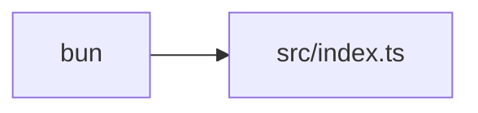

# Specification   Tech Stack

_Standardized technology choices for consistent, fast development optimized for Y Combinator speed and TypeScript safety_

---

## Architecture

## Table of Contents

- [Architecture](#architecture)
- [Runtime](#runtime)
- [Packages](#packages)
- [Testing](#testing)
- [Configuration](#configuration)
- [File Standards](#file-standards)

## Runtime

**bun** - Fast TypeScript runtime, package manager, and test runner

**Why**: 3-5x faster than Node.js, native TypeScript support, unified toolchain

## Packages

| Package                     | Purpose              |
| --------------------------- | -------------------- |
| `@modelcontextprotocol/sdk` | MCP server framework |
| `axios`                     | HTTP client          |
| `zod`                       | Schema validation    |

## Testing

**bun test** - Built-in test runner with Jest-compatible API

**File Organization:**

- `src/utils.ts` → `src/utils.test.ts` (alongside source)
- `src/tools/handler.ts` → `src/tools/handler.test.ts` (alongside source)
- No `__tests__` folders - keep tests next to source files

Follow patterns from `@rules/test.spec.md`
